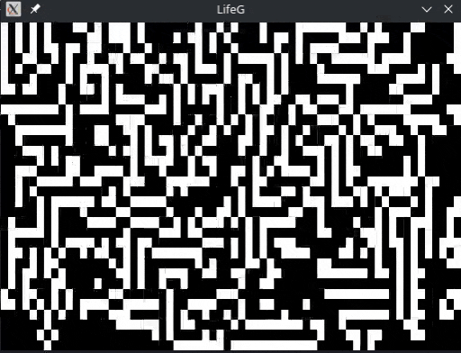

# LifeG
A Conway's Game of Life simulator written in Go.

## Snapshot

Status:
Complete but I still got features to add for the GUI.

References:
[Real](https://robertheaton.com/2018/07/20/project-2-game-of-life/)